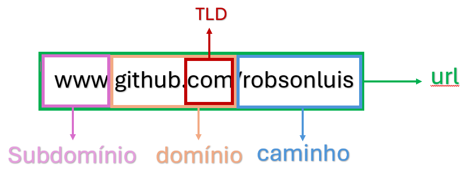

# HTML5 e CSS3
## Atalhos
    * Seleciona o texto e crtl+shift+p e seleciona Envelop com abreviatura 

## Modulo 1
## 1. Bibliografia
    * Referência MDN - Mozilla Develper Network
    * W3C - World Wide Web Consortium
    * WHATWG Living Standard - Web Hypertext Application Technology Working Group
    * W3Schools - Refsnes Data
## 2. Internet
    Começou no periodo da Gerra Fria;
    Nesse período foi criada a ARPANET pelo departamento DARPA;
    www.submarinecablemap.com
    
## 3. Hospedagem e Domínio
### Domínio
    * Nome único
    * Pago anualmente
    * Vários TLDs = .com, .org

### Hospedagem
    * Espaço para armazenamento de arquivos
    * Pago mensalmente
    * Espaço, memória e recursos

## 4. Extensões do Chorme
    * Chrome web store → web developer
## 5. Front-end / Back-end / Full stack
    * Front-end é o que desenvolve para o lado do cliente client-side
    * html5 - css3 - javascript
    * Back-end é o que desenvolve para o lado do servidor server-side
      php - javascript(node) - java - c# - Python - Rubi
## 6. Imagens

### Usar o gimp com ferramenta para edição de fotos.

### 6.1. Formatos de arquivos .gif, .png, .jpg
    * .gif - qualidade ruim, possibilita transparência no fundo e animação;
    * .png - alta qualidade, possibilita transparência;
    * .jpg - boa qualidade, arquivo pequeno, não possibiblita transparência.
### 6.2. Referencias de sites e tipos de buscas
    * Google imagens --> Ferramentas --> direitos de uso
    * Sites
        * pexels.com
        * unsplash.com
### 6.3. Tamanhos de imagens
    * Tamanho razoável para usar em sites pode ser 1500px de largura;
    * Tamanho bom para usar em sites pode ser entre 500px e 650px;
    * A resolução da imagem não precisa ser alta, pode ser considerado entre 50 e 75;
### 6.4. Tags de imagens
    * Com a tag  pode usar arquivos locais ou arquivos que estão na rede;

### 6.5. Favicon

* Baixar icones 
[Site para icones](https://www.iconarchive.com/)
* Desenhar um icone
[Site para criar favicon](https://www.favicon.cc/)
* Criar um icone ou transformar um png, jpg em ico
[Site para criar um favicon](https://favicon.io/)

## 7. Hierarquia de Titulos
    * Vai de H1 até H6
    * Funciona como  um índice de livro Começando com o mais importante H1 até o menos importante que é o H6

## 8. Semântica HTML5
    * Semântica é estudo do significado dos vocábulos, por oposição à sua forma. 
    * Existem tags que funcionam mais estão descontinuadas no HTML. Porque o HTML foca na semantica e para forma usa-se o CSS

## 9. Formatação de Textos
    * Tags Semânticas
        * STRONG - Um tipo de negrito para dar destaque;
        * EM - Um tipo de itálico para dar ênfase;
        * SMALL - Diminue a fonte, mais num contexto de menos importancia para o texto;
        * DEL - Como um taxado, que indica um texto excluído que pode ser lido;
        * INS - Como um sublinhado que indica um texto inserido;
        * SUP - É um texto menor na parte superior, indicando por exemplo exponenciação;
        * SUB - É um texto menor na parte inferior, indicando por exemplo ligações químicas;
    * Tags Não Semânticas
        * B - Negrito;
        * I - Itálico;
        * MARK - marcado como marca texto;
        * BIG - aumenta o tamanho da fonte;
        * U - Taxado;
